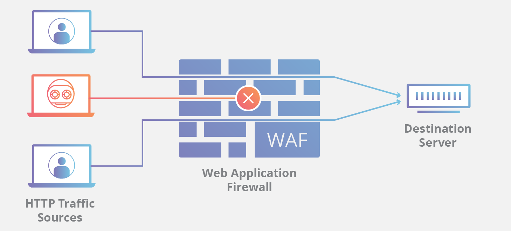
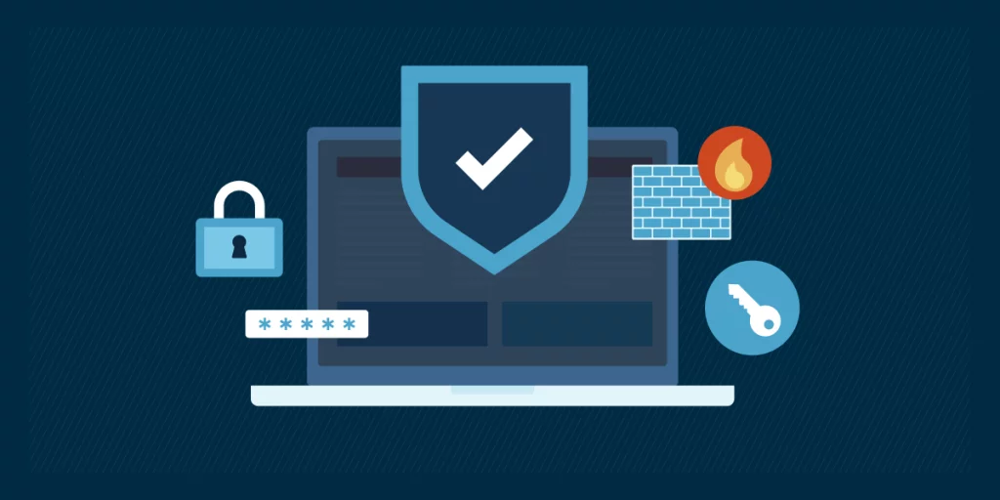
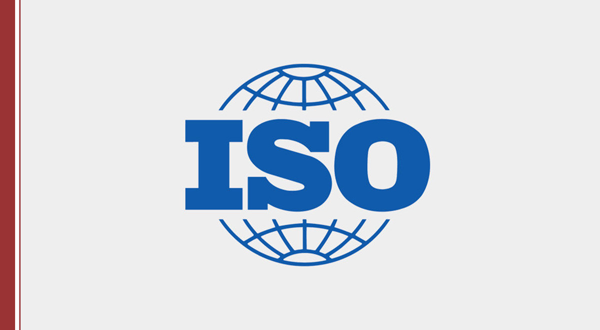
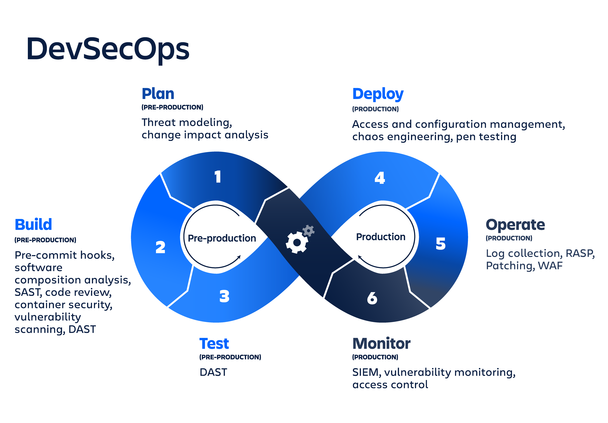

# Capítulo V: Recomendaciones y Plan de Mitigación

Tras el análisis exhaustivo de vulnerabilidades realizado durante los Sprints 1 a 4, y basándonos en las evidencias de explotación y post-explotación documentadas, este capítulo detalla la estrategia de remediación. El objetivo es transformar la postura de seguridad de la organización de un estado reactivo a uno proactivo y resiliente.

Las recomendaciones se dividen en acciones técnicas inmediatas y mejoras organizacionales estratégicas, culminando en una matriz de priorización para facilitar la toma de decisiones gerenciales.

## 5.1. Recomendaciones Técnicas

Estas medidas están orientadas a la corrección directa de los fallos de seguridad identificados en la infraestructura tecnológica, aplicaciones web y APIs de la empresa cliente.

### 5.1.1. Gestión de Parches y Actualizaciones (Patch Management)
Se detectó software obsoleto en servidores y librerías de terceros. Es imperativo implementar una política de "Patch Tuesday" o actualización continua:
*   **Sistemas Operativos:** Actualizar el kernel de los servidores Linux/Windows a las versiones estables más recientes para mitigar vulnerabilidades de escalamiento de privilegios locales.
*   **Servicios Web:** Actualizar versiones de servidores web (ej. Apache, Nginx, IIS) y lenguajes (PHP, Python, Java) para cerrar brechas CVE conocidas.
*   **Dependencias:** Utilizar herramientas como *OWASP Dependency Check* en el ciclo de desarrollo para detectar librerías vulnerables antes del despliegue.

### 5.1.2. Implementación de WAF (Web Application Firewall)
Para proteger las aplicaciones web contra ataques comunes del OWASP Top 10 (como Inyección SQL y Cross-Site Scripting - XSS) que no puedan ser corregidos inmediatamente a nivel de código:
*   **Despliegue:** Implementar un WAF (ej. ModSecurity con reglas OWASP Core Rule Set, o soluciones en nube como AWS WAF/Cloudflare).
*   **Configuración:** Configurar en modo "Bloqueo" para endpoints críticos y modo "Detección" para el resto mientras se ajustan los falsos positivos.

### 5.1.3. Endurecimiento de Sistemas (Hardening)
Reducción de la superficie de ataque mediante la configuración segura de los activos:
*   **Deshabilitación de Servicios:** Apagar servicios no esenciales detectados durante el escaneo con Nmap (ej. FTP, Telnet) y utilizar protocolos seguros (SFTP, SSH v2).
*   **Gestión de Puertos:** Configurar el firewall perimetral y local (iptables/UFW) para permitir tráfico solo en puertos estrictamente necesarios (ej. 80, 443).
*   **Cabeceras de Seguridad:** Implementar cabeceras HTTP de seguridad en el servidor web:
    *   `Strict-Transport-Security (HSTS)`
    *   `X-Content-Type-Options: nosniff`
    *   `X-Frame-Options: DENY`
    *   `Content-Security-Policy (CSP)`

### 5.1.4. Gestión de Identidades y Accesos (IAM)
*   **Principio de Mínimo Privilegio:** Revisar los roles de usuario en la base de datos y aplicación; los usuarios no deben operar con permisos de *root* o *admin* por defecto.
*   **Autenticación Robusta:** Implementar obligatoriamente la autenticación de doble factor (2FA/MFA) para todos los accesos administrativos y VPNs.
*   **Gestión de Secretos:** Eliminar credenciales hardcodeadas en el código fuente y utilizar bóvedas de secretos (ej. HashiCorp Vault).

## 5.2. Recomendaciones Organizacionales

La tecnología por sí sola no garantiza la seguridad. Es necesario fortalecer el "Firewall Humano" y los procesos de gestión.

### 5.2.1. Capacitación y Concientización (Awareness)
Dado que la ingeniería social sigue siendo un vector de ataque primario:
*   **Talleres Periódicos:** Realizar sesiones trimestrales sobre identificación de Phishing, seguridad en contraseñas y navegación segura.
*   **Simulacros:** Ejecutar campañas de phishing ético controlado para medir el nivel de alerta de los empleados y reforzar el aprendizaje práctico.

### 5.2.2. Políticas y Procedimientos
Establecer un marco normativo claro alineado a estándares como ISO 27001 o NIST:
*   **Política de Contraseñas:** Definir requisitos de complejidad, longitud y rotación (o monitoreo de compromiso) alineados a NIST SP 800-63B.
*   **Política de Respuesta a Incidentes:** Crear y documentar un *Playbook* que defina roles, canales de comunicación y pasos técnicos a seguir ante una brecha de seguridad (Contención, Erradicación, Recuperación).
*   **Acuerdos de Confidencialidad (NDA):** Asegurar que todos los colaboradores y proveedores firmen acuerdos que protejan los datos sensibles de la empresa.

### 5.2.3. Seguridad en el Ciclo de Desarrollo (DevSecOps)
*   **Shift-Left Security:** Integrar pruebas de seguridad (SAST/DAST) desde las fases iniciales del desarrollo de software.
*   **Revisión de Código:** Establecer *Peer Reviews* obligatorios centrados en seguridad antes de cualquier paso a producción.

## 5.3. Priorización por Impacto/Urgencia

A continuación, se presenta el **Plan de Mitigación (Roadmap)**. Las acciones se han priorizado evaluando el riesgo (Probabilidad x Impacto) descubierto durante el pentesting frente al esfuerzo de implementación.

**Leyenda de Plazos:**
*   **Corto Plazo:** Inmediato - 1 mes (Acciones críticas de "Quick Win").
*   **Mediano Plazo:** 1 - 3 meses (Proyectos tácticos).
*   **Largo Plazo:** 3 - 6+ meses (Cambios estratégicos y culturales).

| ID | Hallazgo / Vulnerabilidad | Acción de Mitigación Recomendada | Prioridad | Plazo | Esfuerzo |
|:--:|:--------------------------|:---------------------------------|:---------:|:-----:|:--------:|
| **R-01** | Inyección SQL en Login | Sanitización de entradas (Prepared Statements) en código y activación de WAF. | **Crítica** | Corto | Medio |
| **R-02** | Software de Servidor Obsoleto | Actualización de Apache/IIS y sistema operativo base. | **Alta** | Corto | Bajo |
| **R-03** | Credenciales por Defecto | Cambio de contraseñas administrativas en routers y paneles de control. | **Crítica** | Corto | Bajo |
| **R-04** | Falta de Cifrado (HTTP) | Implementación de certificados SSL/TLS y forzar redirección HTTPS. | **Alta** | Corto | Medio |
| **R-05** | Exposición de Datos Sensibles | Enmascaramiento de datos en logs y respuestas de API. | Medio | Medio | Medio |
| **R-06** | Ausencia de MFA | Implementación de Doble Factor de Autenticación para accesos remotos. | **Alta** | Medio | Alto |
| **R-07** | Política de Contraseñas Débil | Definición y aplicación de GPO/Políticas de complejidad de contraseñas. | Medio | Medio | Bajo |
| **R-08** | Falta de Cultura de Seguridad | Programa de capacitación y concientización contra Phishing. | Medio | Largo | Alto |
| **R-09** | Logs Insuficientes | Implementación de un sistema centralizado de logs (SIEM básico) para monitoreo. | Bajo | Largo | Alto |
| **R-10** | Desarrollo Inseguro | Adopción de metodología DevSecOps y escaneo de código estático. | Bajo | Largo | Alto |